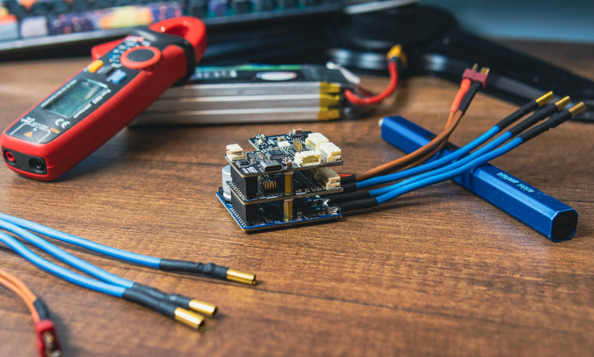
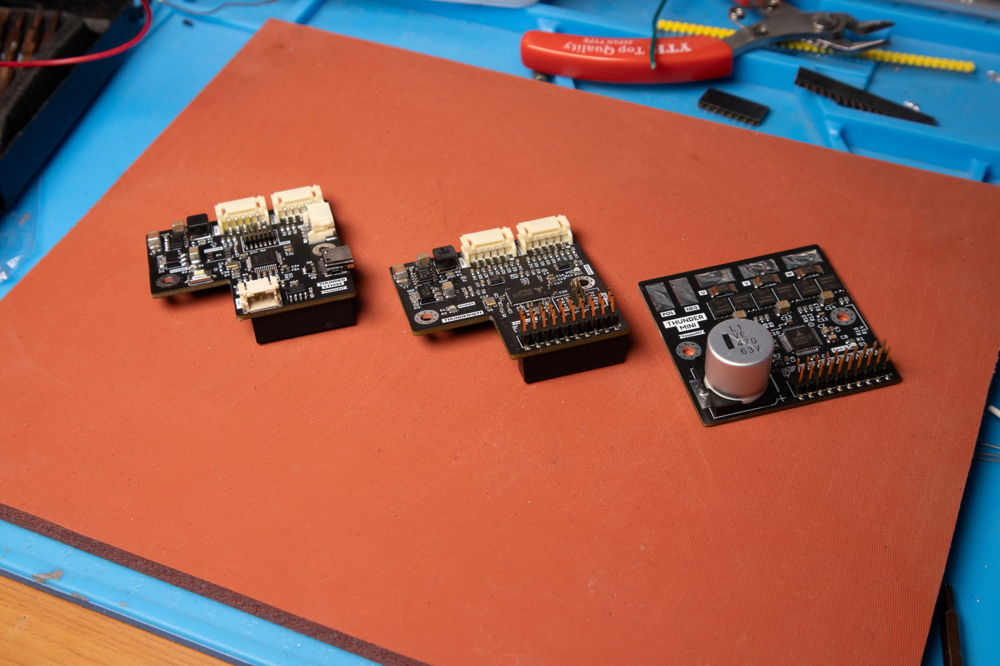

# ThunderMini Brushless Motor Driver

A modular, stackable brushless motor driver platform based on the  **TMC6200**, **TMC4671**, and **STM32G473**.

## Overview

ThunderMini is a brushless motor driver system consisting of **three separate PCBs** that can be stacked together or used individually, depending on the application.

### Boards:

- **ThunderMini**:
  Main power stage based on the **TMC6200** 3-phase gate driver.

- **Thunder4671**:
  Control board based on the **TMC4671** for hardware-based FOC control.

- **ThunderSTM32**:
  **STM32G473** microcontroller board used to control the TMC4671 or to run
  software-based FOC control (e.g. *SimpleFOC*).

**This project is work in progress and is *NOT* ready to use.**

---

### License
 This work is licensed under a <a rel="license" href="http://creativecommons.org/licenses/by-sa/4.0/">Creative Commons Attribution-ShareAlike 4.0 International License</a>.